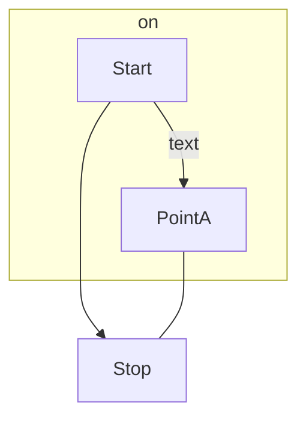
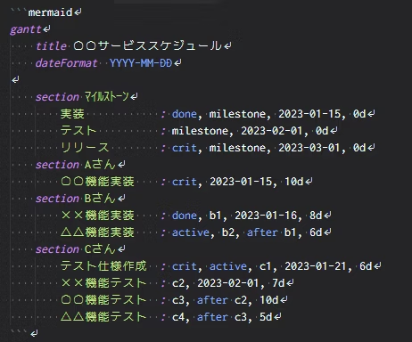
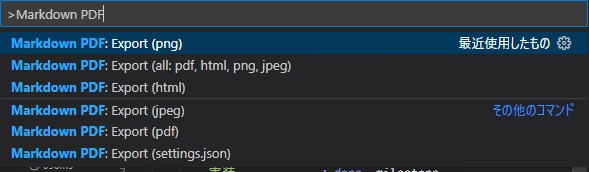

###マークダウン記法の書き方
まず、Visual Studio Code で .md ファイルを作成します。

その後、以下のようにmermaidをキーワードにしてコードを記述します。
’’’mermaid
flowchart TD
    Start --> Stop
    subgraph on
    Start --> |text|PointA
    end
    PointA --- Stop
’’’
**point**
上記の’’’表記を小文字にすると下のようにプレビューできる

###おすすめの拡張機能
. [Mermaid Markdown Syntax](https://marketplace.visualstudio.com/items?itemName=bpruitt-goddard.mermaid-markdown-syntax-highlighting)

上記の画像のように文字に蛍光色を付ける事ができる
. [Markdown PDF](https://marketplace.visualstudio.com/items?itemName=yzane.markdown-pdf)
出力したいMarkdownファイルを開き、コマンドパレットで出力形式を選択するとMarkdownのあるフォルダにファイルが出力されます。

この拡張機能で対応している出力形式は以下となります。

・HTML
・PNG
・JPEG
・PDF

以下のサイトより引用
https://qiita.com/sato_kana/items/2a13f19017576488f017

https://usefuledge.com/vscodemermaidsupport.html